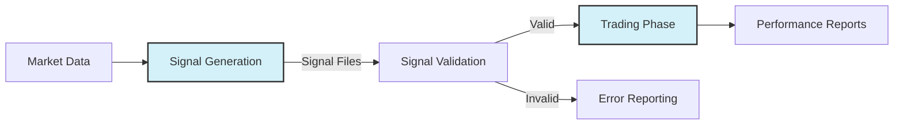
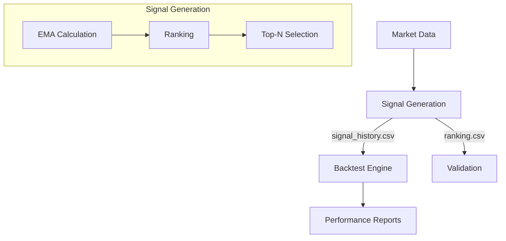
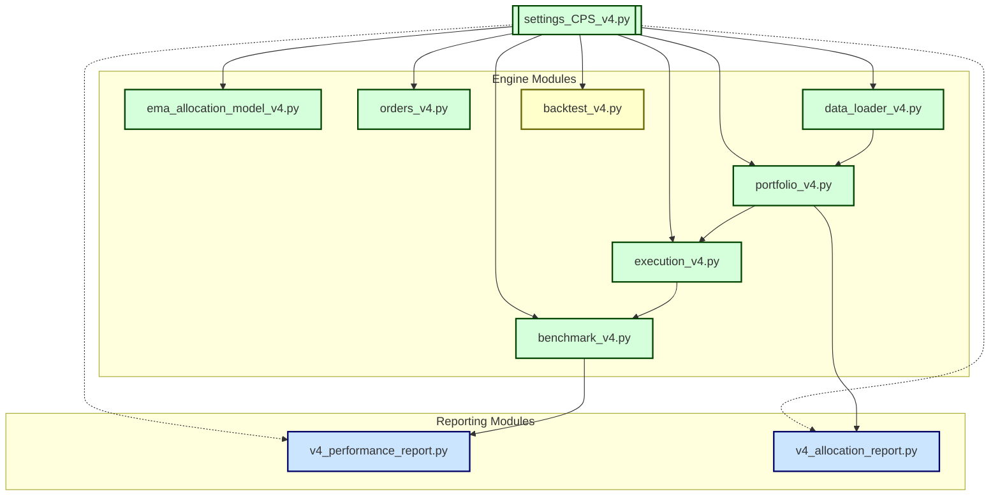

# CPS V4 Master Plan and Roadmap

## Core Principles

> **PROJECT OBJECTIVE (2025-06-19):**
>
> The goal is a simple, super-flexible, and optimizable production flow where every key parameter, especially the core algorithm, is controlled by settings, not code.
>
> - Focus on creating a simple but super flexible optimizable production flow.
> - All algorithm selection and parameters must be configurable via settings.
> - Testing should focus on validating the production pipeline, not creating synthetic test paths.

## Overview

> **IMPORTANT PROJECT POLICY (2025-06-12, UPDATED 2025-06-19):**
> 
> - All validation and output verification must use ONLY the full production code flow (real backtest engine and reporting pipeline). Synthetic/test module validation is prohibited.
> - All fixes, diagnostics, and verification must be performed in the production pipeline only. Use end-to-end tests with checklists for output verification.
> - Configuration must drive all key parameters, especially algorithm selection and parameters.

This document serves as the master planning reference for the CPS V4 transition project. It provides a high-level strategic roadmap, visualization of system components, and testing strategy while cross-referencing detailed tasks in other documents.

## Current Status (2025-06-21)

### Signal Generation and Backtest Integration

- **Signal Generation Script**: `v4/run_signal_generation.py`
- **Backtest Engine**: `v4/engine/backtest_v4.py`
- **Signal Output Location**: `v4_trace_outputs/`
  - `ranking_{timestamp}.csv` - Asset ranks (1 = best) for each period
  - `signal_history_full_{timestamp}.csv` - Final allocation weights (Top N assets only)
  - `signal_history_filtered_{timestamp}.txt` - Human-readable signal summary

### Key Parameters in Use

- `system_top_n` - Number of top assets to select (from strategy settings)
- `st_lookback`, `mt_lookback`, `lt_lookback` - EMA periods for signal calculation

### Verification Steps

1. Run `run_main_v4_prod2.bat`
2. Check console for errors/warnings
3. Verify output files in `v4_trace_outputs/`
4. Confirm Top N assets have equal weights (1/N)
5. All other assets should have 0 weight
6. Backtest engine reads and validates signal file before execution

## Decoupled Signal and Trading Phases (2025-06-22)

### Current Implementation
- **Signal Generation** and **Trading** phases are currently coupled in `run_v4_decoupled_pipeline.py`
- A single failure in either phase can prevent the other from completing
- No clear separation of concerns between signal generation and trading logic

### New Implementation Plan

### Implementation Details

#### Phase Script Modifications
- **Signal Phase (`run_signal_phase.py`):**
  - Add `if __name__ == "__main__"` block for direct execution
  - Ensure all outputs are written to `v4_trace_outputs/`
  - Generate `Signalwtg_output_*.parquet` for trading phase
  - Include validation of output files before completion

- **Trading Phase (`run_trading_phase.py`):**
  - Add `if __name__ == "__main__"` block for direct execution
  - Read signals from `Signalwtg_output_*.parquet`
  - Include validation of input signals before processing
  - Generate performance reports in `v4_trace_outputs/`

#### Batch Script Updates (`run_main_v4_prod2.bat`)
- Replace call to `run_v4_decoupled_pipeline.py` with sequential execution of:
  1. `run_signal_phase.py`
  2. `run_trading_phase.py`
- Implement status checking between phases
- Generate consolidated logs in `v4_trace_outputs/`

#### Error Handling & Validation
- **Signal Phase Validation:**
  - Verify all required output files are generated
  - Validate signal values (0-1 range, sum to 1, etc.)
  - Check for missing or invalid data

- **Trading Phase Validation:**
  - Verify signal file exists and is valid
  - Check for sufficient capital
  - Validate trade execution results

### Key Changes
1. **Independent Execution**
   - Each phase runs as a separate process
   - Signal generation completes fully before trading begins
   - Trading phase can be skipped or retried independently

2. **File-Based Handoff**
   - Signal phase writes all outputs to `v4_trace_outputs/`
   - Trading phase reads signals from `Signalwtg_output_*.parquet`
   - Clear validation step between phases

3. **Error Handling**
   - Each phase has independent error handling
   - Signal generation errors don't affect trading phase execution
   - Clear logging of which phase failed

4. **Validation Workflow**
   - New `/filtered_log_review` command for checking run status
   - Automated checks for required output files
   - Clear success/failure indicators for each phase
   - Detailed logging in `v4_trace_outputs/filtered_*.txt`

### Deprecation Notice
- `run_v4_decoupled_pipeline.py` will be deprecated
- All new development should use the direct phase scripts
- Temporary hotfixes (like the BacktestEngine patch) will be removed

## New Staged Architecture (2025-06-21)

- **Signal Generation**: 
  - Computes EMAs, ranks assets, selects Top N
  - Outputs `signal_history.csv` with target allocations
  - Generates validation files for verification
  
- **Backtest Engine**: 
  - Loads pre-computed signals from `signal_history.csv`
  - Matches signals with market data timestamps
  - Executes trades based on target allocations
  
- **CPS v4 Parameter Constraint**: All parameters driven by CPS v4 settings

## Strategic Direction

- **Goal:** Complete V3 to V4 transition with radically simplified parameter management and system structure
- **Philosophy:** Direct parameter access, no adapters or fallbacks, modular design (<450 lines per module)
- **Priority Shift:** Stabilize core engine and V4 reporting via config-driven testing before GUI integration

## System Visualization

### Module Conversion Status

### Module Conversion Matrix

| Module Type     | Module Name                      | Status       | Location      | Notes                                     |
| --------------- | -------------------------------- | ------------ | ------------- | ----------------------------------------- |
| **Core Engine** | ema_allocation_model_v4.py       | L2 Converted | models/       | Complete                                  |
| **Core Engine** | orders_v4.py                     | L2 Verified  | engine/       | No changes needed                         |
| **Core Engine** | portfolio_v4.py                  | L2 Converted | engine/       | Complete                                  |
| **Core Engine** | execution_v4.py                  | L2 Converted | engine/       | Complete                                  |
| **Core Engine** | data_loader_v4.py                | L2 Converted | engine/       | Fixed date range filtering and parameter passing |
| **Core Engine** | benchmark_v4.py                  | L2 Verified  | engine/       | No changes needed                         |
| **Core Engine** | backtest_v4.py                   | L2 Converted | engine/       | Core functionality complete, tracing added |
| **Utility**     | date_utils.py                    | L1 Verified  | utils/        | No parameter changes needed               |
| **Utility**     | trade_log.py                     | L1 Verified  | utils/        | Default parameter removed                 |
| **Reporting**   | v4_performance_report.py         | In Progress  | v4_reporting/ | Implementation in progress, not yet functional |
| **Reporting**   | v4_allocation_report.py          | In Progress  | v4_reporting/ | Implementation in progress, not yet functional |
| **Legacy**      | V3_perf_repadapt_legacybridge.py | Archived     | v3_engine/    | Comment added only                        |
| **GUI**         | gui_actions_v4.py                | Converted    | app/gui/      | Deferred testing                          |
| **GUI**         | gui_core_v4.py                   | Converted    | app/gui/      | Deferred testing                          |
| **GUI**         | parameter_widgets_v4.py          | Converted    | app/gui/      | Deferred testing                          |

## Phased Implementation Plan

### Phase 1: CPS V4 Foundation & Core Engine Conversion (100% Complete)

- **Status:** Core engine refactoring and validation complete
- **Focus:** Successfully converted and validated core engine modules
- **Key Accomplishments:**
  - ✅ Refactored main production flow to be fully settings-driven
  - ✅ Completed signal generator factory implementation
  - ✅ Removed all hardcoded algorithm dependencies
  - ✅ Fixed date range filtering in data_loader_v4.py
  - ✅ Resolved zero-weight allocations issue
  - ✅ Fixed Portfolio.get_weights() price data handling
  - ✅ Implemented T+0 execution in core engine
  - ✅ Added comprehensive tracing utilities
- **Documentation:**
  - ✅ Created v4_module+functions_list_AI.md
  - ✅ Updated process flow documentation
  - ✅ Added detailed tracing documentation
- **Testing Approach:** End-to-end validation with production pipeline
- **Detailed Tasks:** See [Task_List_CPS_v4.md](Task_List_CPS_v4.md)

### Phase 2: Reporting System & Validation (30% Complete)

- **Status:** Implementation in progress
- **Focus:** Implementing core reporting functionality
- **Current Work:**

  - 🔄 Performance reporting implementation
  - 🔄 Allocation reporting implementation
  - 🔄 Benchmark calculation fixes
- **Remaining Tasks:**
  - Complete core reporting implementation
  - Implement XLSX and PNG outputs
  - Add comprehensive validation tests
  - Document reporting parameters and outputs
  - Integrate with production pipeline
- **Testing Approach:** Output validation against reference reports
- **Detailed Tasks:** See [Task_List_CPS_v4.md](Task_List_CPS_v4.md)

### Phase 3: Optimization & Performance (0% Complete)

- **Status:** Not started
- **Focus:** Optimize and improve performance of the system
- **Key Tasks:**
  - Optimize data loader
  - Improve execution engine performance
  - Optimize benchmark module
  - Profile and optimize critical paths
  - Implement caching where beneficial
- **Testing Approach:** Performance benchmarking and profiling
- **Detailed Tasks:** See [Task_List_CPS_v4.md](Task_List_CPS_v4.md)

### Phase 4: Full System Integration (0% Complete)

- **Status:** Not started
- **Focus:** Complete GUI integration and comprehensive testing
- **Key Tasks:**
  - Connect GUI to V4 engine
  - Connect GUI to V4 reporting
  - End-to-end testing
- **Testing Approach:** Full user workflow testing
- **Detailed Tasks:** See [Task_List_CPS_v4.md](Task_List_CPS_v4.md)

## Simplified Testing Strategy

### Testing Core Principles

- **Modular, Isolated Testing:** Test specific connections using production pipeline only
- **Fast Feedback Loops:** Quick run-check-fix cycles with clear outputs
- **Minimal Setup:** No complex test harnesses or frameworks
- **Self-Documenting:** Each test records its own results
- **AI-Driven Fix Loop:** Once tests are established, enable AI to run the full fix cycle

### Test Scripts to Implement

1. **Parameter Passing Test:** Verify settings flow correctly to each module
   - Simple script to confirm parameters load from settings properly
   - Checks against specific expected values

2. **Module Initialization Test:** Verify each V4 module initializes without errors
   - Create minimal settings
   - Attempt to initialize each module
   - Record success/failure

3. **Data Flow Test:** Verify critical data paths between modules
   - Test data loading → allocation → execution flow
   - Focus on interfaces, not implementation details

### AI-Driven Error-Fix Loop

Once core implementation is complete, an AI-driven fix loop will:

1. Run the full test suite
2. For each error found:
   - Analyze and document the root cause
   - Implement a fix
   - Test the fix
   - Document the solution
3. Continue until all tests pass
4. Generate a comprehensive report

## Documentation
- [Parameter Reference](Parameter_Reference_CPS_v4.md)
- [Migration Guide](convert_param_to_v4.md)
- [Testing Strategy](v4_testing_strategy.md)
- [Signal to Trade Workflow](Signals_Trades_Portfolio_Update.md) - Detailed data flow from signal generation to portfolio updates

## Current Status (2025-06-22)

### Recent Changes & Fixes

#### Signal Generation & Output
- **Fixed CSV/Parquet Output:**
  - Removed duplicate timestamped parquet file generation
  - Restored timestamped CSV output (`signals_output_YYYYMMDD_HHMMSS.csv`)
  - Removed non-timestamped CSV output (`signals_output.csv`)
  - Removed `signal_history_full_*.csv` generation
  - Reformatted `ranking_*.csv` to use matrix format with multi-level columns

#### Code Quality & Protection
- Added `WORKING - ONLY CHANGE WITH PERMISSION` markers to critical CSV generation code
- Improved error handling in signal generation and trading phases
- Standardized logging format across modules

### Active Work Items

1. **Automated Validation (Top Priority)**
   - Developing non-interactive validation of log files and CSV outputs
   - Creating automated checks for file formats and content
   - Implementing validation of signal-to-trade flow

2. **Portfolio Initialization Fix**
   - Error: `Portfolio.__init__() got an unexpected keyword argument 'initial_capital'`
   - Status: Under investigation in `backtest_v4.py` and `run_trading_phase.py`
   - Temporary fix applied in hotfix, but needs permanent solution

3. **Signal-to-Trade Flow**
   - Ensuring proper signal format for trading engine
   - Validating signal file reading in trading phase
   - Confirming trade execution matches signal intent

### Next Steps
1. Implement automated validation workflow
2. Resolve Portfolio initialization error
3. Verify signal-to-trade flow integrity
4. Complete end-to-end testing of the pipeline
5. Update documentation with new file formats and parameters

### Recent Updates
- 2025-06-22: Fixed CSV/Parquet output generation
- 2025-06-22: Added code protection markers
- 2025-06-21: Implemented decoupled signal and trading phases

- **Active Issue:** Verifying backtest output date ranges and allocation history
- **Recent Fixes:**
  - Refactored data_loader_v4.py to properly respect date ranges from settings
  - Fixed parameter passing to prevent static filtering of data
  - Resolved file system access verification
- **Next Steps:**
  - Verify backtest outputs in v4_trace_outputs
  - Confirm correct date range in output files
  - Validate non-zero allocation weights in results
  - Add additional diagnostics if needed: [Problem_Changes_Log_CPS_v4.md](Problem_Changes_Log_CPS_v4.md)

## Status Tracking

| Phase               | Status | Started | Completed | Next Steps                                                                |
| ------------------- | ------ | ------- | --------- | ------------------------------------------------------------------------- |
| 1. Core Engine      | 100%   | Yes     | Yes       | Core engine fully validated with production pipeline                     |
| 2. Reporting        | 30%    | Yes     | No        | Core reporting implementation in progress, not yet functional            |
| 3. GUI Code         | 60%    | Yes     | No        | Deferred until reporting validation complete                              |
| 4. Full Integration | 0%     | No      | No        | Awaiting prior phases                                                     |

Last Updated: 2025-06-17
