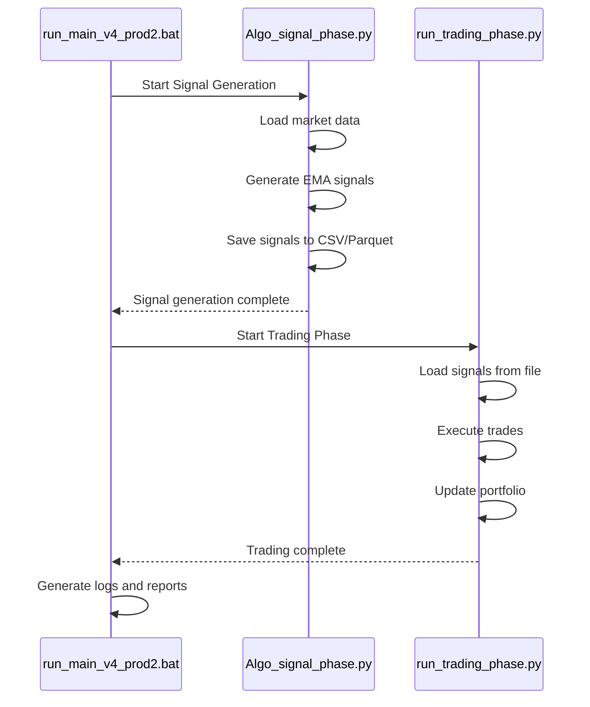

# EMA Signals and Decoupled Execution in CPS V4

## Table of Contents

1. [Signal Generation Overview](#1-signal-generation-overview)
2. [Decoupled Execution Flow](#2-decoupled-execution-flow)
3. [Key Components](#3-key-components)
4. [File Outputs](#4-file-outputs)
5. [Execution Sequence](#5-execution-sequence)

## 1. Signal Generation Overview

The EMA (Exponential Moving Average) signal generation process remains unchanged from the original implementation. It continues to:

- Calculate short, medium, and long-term EMAs
- Compute EMA ratios and trend strength
- Rank assets based on momentum
- Generate allocation signals for the top N assets

## 2. Decoupled Execution Flow

The system now follows a two-phase decoupled architecture:

1. **Signal Generation Phase** (`Algo_signal_phase.py`)
   - Runs independently
   - Generates and saves signals to CSV files
   - Creates a handoff file for the trading phase

2. **Trading Phase** (`run_trading_phase.py`)
   - Runs after successful signal generation
   - Loads signals from the handoff file
   - Executes trades based on the signals

## 3. Key Components

### 3.1 Signal Generation (`v4/Algo_signal_phase.py`)

- **Input**: Market data from configured sources
- **Processing**:
  - Loads settings and data
  - Generates signals using EMA model
  - Saves outputs to CSV and Parquet formats
- **Output**:
  - `signals_output_YYYYMMDD_HHMMSS.csv`
  - `signals_output.parquet` (standard name)
  - Log files in `v4_trace_outputs/`

### 3.2 Trading Execution (`v4/run_trading_phase.py`)

- **Input**:
  - Signal file from generation phase
  - Market data
- **Processing**:
  - Validates signals
  - Executes trades
  - Manages portfolio
- **Output**:
  - `allocation_history_YYYYMMDD_HHMMSS.csv`
  - `trade_log_YYYYMMDD_HHMMSS.csv`
  - Standard-named versions of the above

### 3.3 Orchestration (`run_main_v4_prod2.bat`)

- Manages the execution sequence
- Handles error conditions
- Manages log files

## 4. File Outputs

### Signal Generation Outputs

- `v4_trace_outputs/signals_output_YYYYMMDD_HHMMSS.csv`
  - Timestamped CSV of signals
  - Format: Date, Asset1, Asset2, ...
- `v4_trace_outputs/signals_output.parquet`
  - Standard-named Parquet file with same data
  - Used by trading phase

### Trading Phase Outputs

- `v4_trace_outputs/allocation_history_YYYYMMDD_HHMMSS.csv`
  - Historical allocation weights
- `v4_trace_outputs/trade_log_YYYYMMDD_HHMMSS.csv`
  - Detailed trade execution log
- Standard-named versions of both files

## 5. Execution Sequence

## 6. Error Handling

The system implements robust error handling:

1. **Signal Generation Failure**
   - Trading phase is skipped
   - Error is logged
   - Process exits with non-zero status

2. **Trading Phase Failure**
   - Error is logged
   - Process exits with non-zero status
   - Previous signal files are preserved

3. **Logging**
   - Full logs saved with timestamps
   - Filtered logs highlight important events
   - All errors include stack traces

## 7. Configuration

Configuration is managed through:

- `settings_CPS_v4.ini`: Main configuration file
- Environment variables for sensitive data
- Command-line arguments for runtime overrides

## 8. Monitoring and Debugging

To monitor execution:

1. Check log files in `v4_trace_outputs/`
2. Review output CSV files for signal details
3. Use filtered logs for high-level status

For debugging:

1. Run phases independently
2. Check intermediate files
3. Review error logs for detailed information

## 3. Parameters and Configuration

The model relies on parameters loaded from the CPS V4 settings (`CPS_V4.settings_CPS_v4.load_settings()`):

- **Lookback Periods (from `settings['ema_model']` or `settings['strategy']`):**
  - `st_lookback`: Short-term EMA lookback period (e.g., 15 days).
  - `mt_lookback`: Medium-term EMA lookback period (e.g., 70 days).
  - `lt_lookback`: Long-term EMA lookback period (e.g., 100 days).
- **Weight Bounds (from `settings['ema_model']` or `settings['strategy']`):**
  - `min_weight`: Minimum allowable weight for an asset (e.g., 0.0).
  - `max_weight`: Maximum allowable weight for an asset (e.g., 1.0).
- **System Top N (from `settings['system_top_n']`):**
  - `system_top_n`: The number of top-ranked assets to consider for allocation.
- **Signal Algorithm (from `settings['strategy']['signal_algo']`):**
  - `signal_algo`: Specifies the allocation rule set to use (e.g., 'ema', which then maps to rules in `allocation_rules_v4.py`).

These parameters are fetched using helper functions `_get_param` and `_to_numeric` within the module to handle potential dictionary structures in the settings (e.g., for complex parameters).

## 4. Signal Generation Steps

The core logic is within the `ema_allocation_model` function in `v4/models/ema_allocation_model_v4.py`.

### Step 1: Calculate EMA Metrics

- **Function:** `calculate_ema_metrics(price_data)`
- **Input:** `price_data` (DataFrame of historical close prices for each asset).
- **Process:** For each asset in `price_data`:
  - Calculate Short-Term EMA (Short_EMA) using `tech_exponential_moving_average(price_data[asset], window=st_lookback)`.
  - Calculate Medium-Term EMA (Med_EMA) using `tech_exponential_moving_average(price_data[asset], window=mt_lookback)`.
  - Calculate Long-Term EMA (Long_EMA) using `tech_exponential_moving_average(price_data[asset], window=lt_lookback)`.
- **Output:** Three DataFrames: `short_ema`, `med_ema`, `long_ema`, each containing the respective EMA values for all assets over time.

### Step 2: Calculate EMA Ratios

- **Function:** `calculate_ema_ratios(short_ema, med_ema, long_ema)`
- **Input:** The `short_ema`, `med_ema`, and `long_ema` DataFrames from Step 1.
- **Process:** For each asset, calculate the following ratios for the latest available date (or the date for which signals are being generated):
  - **STMTEMAX** (Short-Term / Medium-Term EMA Ratio): `Short_EMA / Med_EMA`
  - **MTLTEMAX** (Medium-Term / Long-Term EMA Ratio): `Med_EMA / Long_EMA`
  - **EMAXAvg** (Average EMA Ratio): `(STMTEMAX + MTLTEMAX) / 2`
- **Output:** 
  - `stmtemax_df`, `mtltemax_df`, `emaxavg_df`: DataFrames containing the historical values of these ratios.
  - `stmtemax`, `mtltemax`, `emaxavg`: Series containing the latest values of these ratios for each asset.

### Step 3: Rank Assets

- **Process:** The assets are ranked based on their latest `EMAXAvg` values in descending order. A higher `EMAXAvg` suggests stronger positive momentum.
- **Output:** A pandas Series `ranked_assets` with asset symbols as the index, sorted by `EMAXAvg`.

### Step 4: Select Top N Assets

- **Process:** Assets with rank ≤ `system_top_n` (from settings) are selected for each period.
- **Output:** A boolean mask DataFrame `mask` and list of selected asset symbols.

### Step 5: Equal-Weight Allocation

- **Process:** Assign equal weight of `1/N` to each selected asset, where `N` = `system_top_n`; non-selected assets receive weight 0.
- **Output:** A DataFrame of allocation weights normalized per date.

### Step 6: Output and Saving

- **Process:** The allocation weights are returned as `{Timestamp: {symbol: weight}}` by `EMASignalGenerator.generate_signals`, converted into a DataFrame in `run_signal_generation.py`, and saved to CSV.
- **Output:** CSV files saved in `v4_trace_outputs`: `ranking_{ts}.csv` and `signal_history_full_{ts}.csv`.

## 5. Output Format

The `ema_allocation_model` function returns the `weights` dictionary for the current period.

The `ema_allocation_model_updated` function wraps this, returning a dictionary where the key is the current `pd.Timestamp` (last date in `price_data`) and the value is the `weights` dictionary. This format `{pd.Timestamp: {symbol: weight}}` is for compatibility with the backtesting engine's `signal_history` format.

## 6. Relationship to `trace_ema_signals.py`

The script `v4/tests/trace_ema_signals.py` is designed to execute parts of this logic (specifically EMA calculations and potentially trend strength/ratios) for a given date range and output intermediate values to CSV files. This allows for detailed verification of these calculations against the production logic described above.

By comparing the outputs of `trace_ema_signals.py` (like `ema_values_*.csv`, `ema_trend_strength_*.csv`) with manual calculations or expected values based on the formulas in `ema_allocation_model_v4.py`, one can debug and verify the signal generation process.
