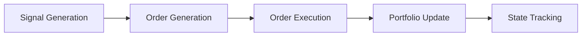

# V4 Backtest Engine: Signal to Trade Workflow

This document details the data flow and component interactions within the V4 backtest engine, tracing the path from signal generation through portfolio updates.

## 1. Signal Generation

**Key Modules:** `ema_allocation_model_v4.py`, `backtest_v4.py`

- **Process:**
  - `BacktestEngine.run_backtest` calls the configured `signal_generator` (e.g., `ema_allocation_model_updated`).
  - **Inputs:**
    - `price_data`: Historical price data up to the current date
    - `signal_params`: Parameters for signal generation
  - **Output:**
    - `signals_dict`: A dictionary with timestamps as keys and allocation series as values.
  - The engine extracts the current date's target allocations into a `pd.Series`.

## 2. Order Generation

**Key Modules:** `allocation_v4.py`, `backtest_v4.py`

- **Process:**
  - `BacktestEngine.run_backtest` calls `calculate_rebalance_orders(portfolio, signals, current_prices)`.
  - `calculate_rebalance_orders` in `allocation_v4.py`:
    1. Retrieves `portfolio_value` and `current_positions` from the portfolio.
    2. Calls `compare_positions(current_positions, target_allocations, portfolio_value, prices)` to compute `dollar_changes` needed to reach target allocations.
    3. Calls `generate_orders(dollar_changes, prices, order_date, available_cash)` to create `Order` objects, considering:
       - Cash constraints
       - Commission costs
       - Slippage
       - Rounding to whole shares

## 3. Order Execution

**Key Modules:** `execution_v4.py`, `backtest_v4.py`

- **Process:**
  - `BacktestEngine.run_backtest` calls `self.execution_engine.execute_orders(orders, execution_date, execution_prices)`.
  - `ExecutionEngine.execute_orders`:
    1. Iterates through the list of `Order` objects.
    2. For each order:
       - Applies commission using `self.commission_model.calculate_commission(order_value)`.
       - Applies slippage using `self.slippage_model.apply_slippage(price, order.action)`.
       - Creates a `Trade` object representing the executed transaction.
       - Calls `self.portfolio.update_from_trade(trade)` to update the portfolio's cash and positions.
       - Logs the trade in `self.trade_log`.

## 4. Portfolio Update

**Key Module:** `portfolio_v4.py`

- **Process:**
  - `Portfolio.update_from_trade(trade)`:
    - For `BUY` orders:
      - Deducts the total cost (including commission) from cash.
      - Calls `self.add_position(trade.symbol, trade.quantity, trade.price, cost_basis=trade.price)`.
    - For `SELL` orders:
      - Adds the proceeds (after commission) to cash.
      - Calls `self.remove_position(trade.symbol, trade.quantity, trade.price)`.
    - Calculates and returns P&L for sell trades.

## 5. Portfolio State Tracking

**Key Modules:** `portfolio_v4.py`, `backtest_v4.py`

- **Mark-to-Market:**
  - `Portfolio.mark_to_market(current_date, prices)` is called by `run_backtest` at the end of each period.
  - Updates the value of existing positions based on current prices.
  - Records a snapshot of the portfolio (cash, positions, total value) in `self.history`.

- **Weight Calculation:**
  - `Portfolio.get_weights(prices)` is called by `run_backtest` to populate `weights_history`.
  - Calculates asset weights based on current positions and prices.

- **History Tracking:**
  - `signal_history`: DataFrame in `run_backtest` storing target allocations at each rebalance date.
  - `weights_history`: DataFrame storing actual portfolio weights at each rebalance date.
  - `Portfolio.history`: Dictionary storing snapshots of portfolio state (cash, positions, total value) at each date.

- **Value Tracking:**
  - `Portfolio.get_total_value()`: Returns the current total portfolio value.
  - `Portfolio.get_value_history()`: Returns a Series of historical portfolio values.
  - `Portfolio.cash`: Current cash balance, updated by trades.

## Data Flow Summary

## Key Data Structures

- **Signals:** `pd.Series` of target allocations (weights).
- **Orders:** List of `Order` objects (symbol, action, quantity, price).
- **Trades:** `Trade` objects (symbol, action, quantity, price, commission, slippage).
- **Portfolio State:** Dictionary containing cash, positions, and total value.
- **History:** Time-series DataFrames tracking signals, weights, and portfolio values over time.
