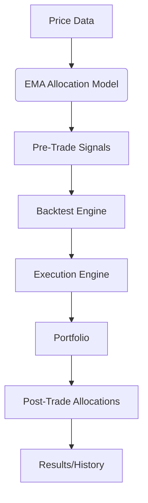

# Signals and Trading Flow Documentation (CPS V4)

## Version Control
- Created: 2025-06-18
- Based on: `trace_ema_signal_breakdown.py` implementation
- Author: Cascade AI (Windsurf Engineering)

## Core Components and Flow

### 1. Signal Generation (`v4/models/ema_allocation_model_v4.py`)
**Inputs**:
- Price data (DataFrame)
- Current date  
- Strategy parameters (from `settings_parameters_v4.ini`)

**Outputs** (when `trace_mode=True`):
1. Final weights dictionary (`{ticker: weight}`)
2. Ratios series (EMAXAvg values)
3. Ranks DataFrame
4. Signal series (pre-trade allocations)

**Process**:
1. Calculate EMA ratios for each asset
2. Rank assets based on ratios
3. Apply allocation rules to generate signals
4. Return all intermediate outputs when tracing

### 2. Backtest Engine (`v4/engine/backtest_v4.py`)
**Key Responsibilities**:
- Manages order scheduling via `pending_orders` queue
- Coordinates daily execution flow
- Maintains portfolio state through time

**Critical Methods**:
- `run_backtest()`: Main entry point
- `process_daily_signals()`: Handles signal conversion to orders
- `execute_pending_orders()`: Coordinates with ExecutionEngine

### 3. Execution Engine (`v4/engine/execution_v4.py`)
**Key Responsibilities**:
- Converts orders to executed trades
- Calculates execution prices with slippage
- Interfaces with Portfolio for position updates

**Critical Methods**:
- `execute_orders()`: Processes orders into trades
- Requires:
  - Execution date
  - Current prices (as dictionary)
  - Order list

### 4. Portfolio Management (`v4/engine/portfolio_v4.py`)
**Key Responsibilities**:
- Maintains single source of truth for positions
- Tracks cash balance and portfolio value
- Calculates performance metrics

**Critical Methods**:
- `mark_to_market()`: Updates values using current prices
- `get_weights()`: Returns current allocations
- `update_from_trade()`: Processes executed trades

## Data Flow Requirements

### Price Data Handling
- Must be converted to dictionary format (`{ticker: price}`) before:
  - Portfolio.mark_to_market()
  - ExecutionEngine.execute_orders()
  - Portfolio.get_weights()

### Order Execution
- T+0 Execution Logic:
  1. Mark portfolio to market
  2. Execute orders at current prices
  3. Update portfolio positions
  4. Calculate post-trade allocations

## Tracing Implementation
Key lessons from `trace_ema_signal_breakdown.py`:
1. Must intercept data at each stage:
   - Raw ratios
   - Ranks 
   - Pre-trade signals
   - Post-trade allocations
2. Requires careful price data type management
3. T+0 simulation must match production logic

## Error Conditions Handled
1. Price data type mismatches (Series vs dict)
2. Missing execution dates
3. Portfolio value calculation edge cases
4. Weight normalization (sum to 1.0)
