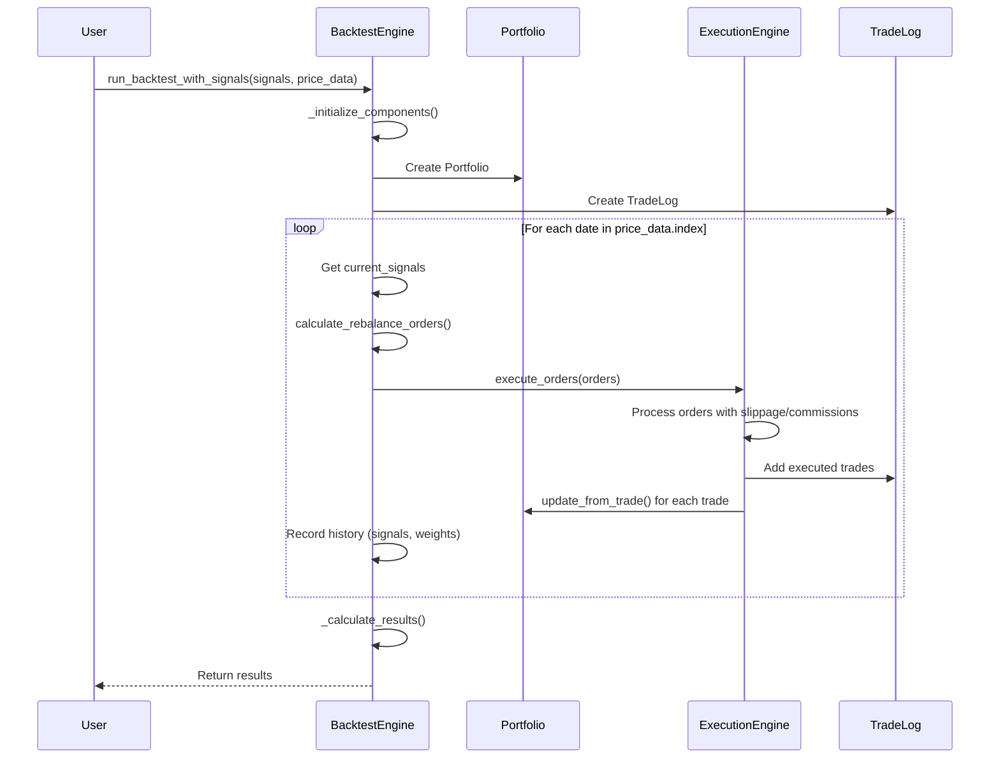
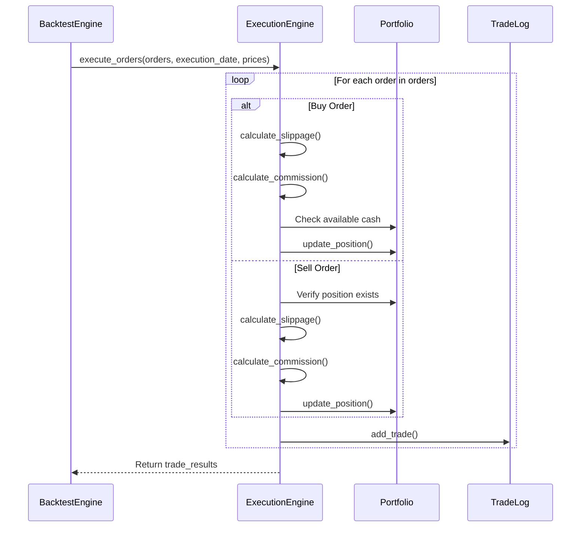

# Trade and Portfolio Engine Flow

## Overview

This document outlines the data flow and component interactions within the trading and portfolio management system. The system is designed to execute backtests with a focus on asset allocation strategies.

## Table of Contents

- [Core Components](#core-components)
- [Data Flow](#data-flow)
- [Execution Sequence](#execution-sequence)
- [Key Data Structures](#key-data-structures)
- [Common Issues and Solutions](#common-issues-and-solutions)
- [Performance Considerations](#performance-considerations)
- [Future Improvements](#future-improvements)
- [Appendix: Sequence Diagrams](#appendix-sequence-diagrams)


## Core Components

### 1. Backtest Engine (`backtest_v4.py`)

- **Purpose**: Orchestrates the backtest execution
- **Key Methods**:
  - `run_backtest_with_signals`: Main entry point for backtesting with pre-computed signals
  - `_initialize_components`: Sets up portfolio and trade log
  - `_calculate_results`: Computes performance metrics
  - `_should_rebalance`: Determines if rebalancing should occur on a given date

### 2. Execution Engine (`execution_v4.py`)
- **Purpose**: Handles order execution and trade processing
- **Key Methods**:
  - `execute_orders`: Processes buy/sell orders with slippage and commissions
  - `PercentSlippageModel`: Applies slippage based on trade direction
  - `PercentCommissionModel`: Calculates trading commissions
- **Key Features**:
  - Processes sell orders before buy orders to free up cash
  - Handles order execution delays
  - Applies transaction costs

### 3. Portfolio Management (`portfolio_v4.py`)
- **Purpose**: Tracks portfolio state and positions
- **Key Methods**:
  - `update_from_trade`: Updates portfolio based on executed trades
  - `get_weights`: Calculates current portfolio weights
  - `mark_to_market`: Updates position values based on current prices
  - `add_position`: Adds to or creates a position
  - `remove_position`: Reduces or closes a position
- **State Management**:
  - Tracks cash balance
  - Maintains position quantities and cost basis
  - Records historical snapshots

### 4. Order Management (`orders_v4.py`)

- **Purpose**: Defines order and trade data structures
- **Key Classes**:
  - `Order`: Represents a trading instruction
  - `Trade`: Represents an executed trade
  - `TradeLog`: Maintains a record of all trades
- **Features**:
  - Trades include execution details (price, commission, etc.)
  - Trade log provides a complete history of all transactions

### 1. Backtest Engine (`backtest_v4.py`)
- **Purpose**: Orchestrates the backtest execution
- **Key Methods**:
  - `run_backtest_with_signals`: Main entry point for backtesting with pre-computed signals
  - `_initialize_components`: Sets up portfolio and trade log
  - `_calculate_results`: Computes performance metrics

### 2. Execution Engine (`execution_v4.py`)
- **Purpose**: Handles order execution and trade processing
- **Key Methods**:
  - `execute_orders`: Processes buy/sell orders with slippage and commissions
  - `PercentSlippageModel`: Applies slippage based on trade direction
  - `PercentCommissionModel`: Calculates trading commissions

### 3. Portfolio Management (`portfolio_v4.py`)
- **Purpose**: Tracks portfolio state and positions
- **Key Methods**:
  - `update_from_trade`: Updates portfolio based on executed trades
  - `get_weights`: Calculates current portfolio weights
  - `mark_to_market`: Updates position values based on current prices

## Data Flow

### Initialization Phase

1. Backtest engine initializes with configuration from CPS v4 settings
   - Loads parameters: `initial_capital`, `commission_rate`, `slippage_rate`
   - Creates portfolio with initial capital
   - Initializes trade log
   - Sets up execution engine with commission and slippage models

### Main Execution Loop (run_backtest_with_signals)

1. **Date Iteration`:
   - For each date in the price data index
   - Skip if no signals exist for the current date

2. **Signal Retrieval**:
   ```python
   current_signals = signals.loc[current_date]
   ```
   - Gets target allocations for current date
   - Signals are expected as a pandas Series with asset symbols as index

3. **Order Generation**:
   ```python
   orders = calculate_rebalance_orders(
       portfolio=portfolio,
       target_allocations=current_signals,
       prices=price_data.loc[current_date],
       order_date=current_date
   )
   ```
   - Converts target allocations to specific buy/sell orders
   - Considers current positions, prices, and transaction costs

4. **Order Execution**:
   ```python
   trade_results = execution_engine.execute_orders(
       orders=orders,
       execution_date=current_date,
       prices=price_data.loc[current_date]
   )
   ```
   - Processes orders through execution engine
   - Applies slippage and commissions
   - Returns list of executed trades

5. **Trade Logging**:
   ```python
   for trade in trade_results:
       trade_log.add_trade(trade)
   ```
   - Records all executed trades with details

6. **Portfolio Update**:
   ```python
   for trade in trade_results:
       portfolio.update_from_trade(trade)
   ```
   - Updates cash balance
   - Updates position quantities and costs
   - Records position values

7. **History Tracking**:
   ```python
   # Record signal history
   signal_history.loc[current_date] = current_signals
   
   # Record weights history
   weights = portfolio.get_weights(price_data.loc[current_date])
   weights_history.loc[current_date] = weights
   ```
   - Tracks target allocations and actual portfolio weights over time

### Results Calculation
1. **Performance Metrics**:
   - Calculates returns (total, monthly, yearly)
   - Computes risk metrics (volatility, max drawdown)
   - Calculates risk-adjusted returns (Sharpe ratio)
   - Tracks turnover and win rate

2. **Diagnostic Checks**:
   - Validates weights history
   - Checks for data quality issues
   - Generates debug information if needed

## Key Data Structures

### Orders
- **Type**: `Order` (from `orders_v4.py`)
- **Attributes**:
  - `symbol`: Asset identifier
  - `quantity`: Number of shares/units (positive for buy, negative for sell)
  - `order_type`: Type of order (market, limit, etc.)

### Trades
- **Type**: `Trade` (from `orders_v4.py`)
- **Attributes**:
  - `execution_date`: When the trade was executed
  - `execution_price`: Price at which the trade was executed
  - `commission`: Trading commission paid
  - `amount`: Total cash flow (negative for buys, positive for sells)

## Common Issues and Solutions

### 1. Position Not Found Warnings

- **Symptom**: `Position {symbol} not found` in logs
- **Cause**: Attempting to sell a position that doesn't exist or has already been closed
- **Solution**:
  - Verify position exists in portfolio before selling
  - Check if position was already closed in a previous trade
  - Ensure consistent symbol naming across signals and portfolio

### 2. Insufficient Quantity Warnings

- **Symptom**: `Insufficient quantity to remove {quantity} shares of {symbol}`
- **Cause**: Trying to sell more shares than are currently held
- **Solution**:
  - Check position quantities before generating sell orders
  - Verify that position quantities are being tracked correctly
  - Consider using `get_weights()` to verify current allocations

### 3. Price Data Type Mismatch

- **Symptom**: `Portfolio.get_weights received prices as a pandas Series`
- **Cause**: Passing pandas Series where a dictionary is expected
- **Solution**:
  ```python
  # Convert Series to dict if needed
  if isinstance(prices, pd.Series):
      prices = prices.to_dict()
  ```

### 4. Zero or Missing Weights

- **Symptom**: `weights_history contains all zeros`
- **Cause**:
  - No trades being executed
  - Signals not being generated properly
  - Portfolio not being updated correctly
- **Solution**:
  - Verify signals contain valid allocations
  - Check trade execution logs
  - Validate portfolio updates after each trade

### 5. Performance Issues

- **Symptom**: Slow backtest execution
- **Causes**:
  - Inefficient data structures
  - Unnecessary data copies
  - Suboptimal pandas operations
- **Solutions**:
  - Use vectorized operations
  - Minimize data copies
  - Pre-allocate data structures when possible

## Performance Considerations
- **Vectorization**: Use pandas/numpy operations where possible
- **Minimize Copies**: Avoid unnecessary data duplication
- **Efficient Lookups**: Use dictionary-based lookups for price data

## Future Improvements

### 1. Enhanced Order Types

- Add support for limit, stop, and trailing stop orders
- Implement time-in-force instructions
- Add order cancellation and modification capabilities

### 2. Advanced Transaction Cost Modeling

- Model market impact
- Add volume-weighted average price (VWAP) execution
- Support for different commission structures

### 3. Risk Management

- Position sizing based on risk metrics
- Drawdown controls
- Risk parity allocation

### 4. Multi-Asset Support

- Unified interface for different asset classes
- Cross-margin requirements
- Currency conversion and hedging

### 5. Performance Optimization

- Parallel processing for multi-asset backtests
- Memory-efficient data structures
- Caching of intermediate results

### 6. Enhanced Reporting

- Interactive visualizations
- Custom performance metrics
- Detailed trade analysis

### 7. Live Trading Integration

- Broker API connections
- Paper trading mode
- Real-time position tracking

## Appendix: Sequence Diagrams

### Backtest Execution Flow


### Order Execution Flow

